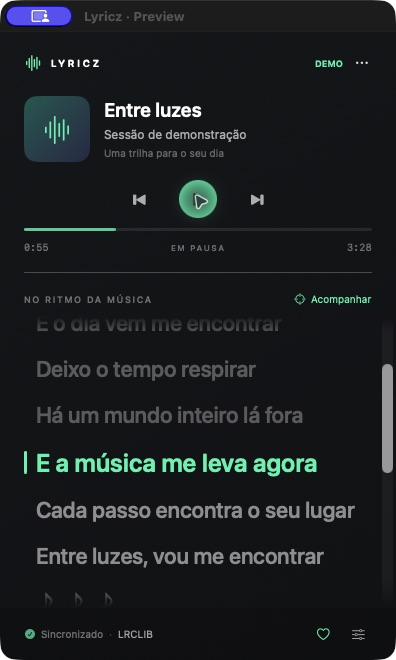
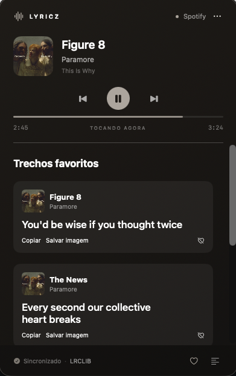
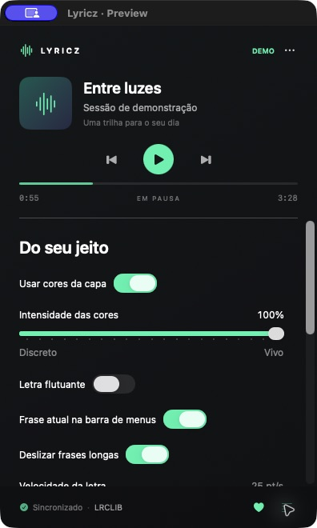

# Lyricz

Letras do Spotify e do Apple Music na barra de menus do Mac. O Lyricz acompanha a música que está tocando e mostra a frase atual sem precisar deixar o player aberto na tela.

Ao clicar na barra, você encontra a letra completa, controles de reprodução e um painel com as cores da capa do álbum. Também dá para deixar a letra numa janela flutuante e salvar seus trechos favoritos.

A interface acompanha o idioma do macOS em português, inglês ou espanhol. Os nomes das músicas e as letras aparecem no idioma original da faixa.

## Conheça a interface

<p align="center">
  
  
  
</p>

Da esquerda para a direita: **letra sincronizada**, **trechos favoritos** e **ajustes**. Capturas do modo de demonstração, com música e letra fictícias.

## Instalação

### Baixar o app pronto

**Quer instalar sem compilar? [Baixe o Lyricz 1.6.0 para Mac com Apple Silicon](https://github.com/luczz1/lyricz/releases/download/v1.6.0/Lyricz-1.6.0-macOS-AppleSilicon.zip).**

1. Baixe o ZIP e dê dois cliques para extrair.
2. Arraste **Lyricz.app** para **Aplicativos**.
3. Abra o Lyricz, escolha Automático, Spotify ou Apple Music, e permita o acesso ao player quando o macOS solicitar.

Esse download é para Macs com chip **M1, M2, M3 ou outro Apple Silicon**, com macOS 13 ou superior. Ainda não há um download pronto para Macs Intel. Todas as versões publicadas ficam em [Releases](https://github.com/luczz1/lyricz/releases).

O app tem assinatura local e ainda não é notarizado pela Apple. Se o macOS bloquear a abertura por não conseguir verificar o desenvolvedor, confira se o arquivo veio deste repositório e, se confiar nele, use **Ajustes do Sistema → Privacidade e Segurança → Abrir Mesmo Assim** após tentar abri-lo.

### Compilar no próprio Mac

Se preferir compilar, siga os passos abaixo.

Você vai precisar de:

- macOS 13 ou superior.
- Spotify para macOS ou o app Música (Apple Music) instalado.
- Xcode ou Command Line Tools com Swift 6 ou superior.
- Internet para buscar letras e carregar capas.

### 1. Prepare as ferramentas

Se ainda não tiver as ferramentas de desenvolvimento da Apple, execute no Terminal:

```sh
xcode-select --install
```

Depois da instalação, confira a versão do Swift:

```sh
swift --version
```

O projeto exige Swift 6 ou superior. Se aparecer uma versão anterior, atualize o Xcode ou as Command Line Tools para uma versão compatível com seu macOS.

### 2. Baixe e compile

```sh
git clone https://github.com/luczz1/lyricz.git
cd lyricz
./scripts/build-app.sh
```

O script gera o aplicativo em `dist/Lyricz.app`. Ele compila para a arquitetura do Mac usado no build e não precisa baixar pacotes Swift externos.

### 3. Abra o aplicativo

```sh
open dist/Lyricz.app
```

Se quiser, copie **Lyricz.app** da pasta `dist` para **Aplicativos** e abra por lá. Faça isso antes de ativar o início automático com o Mac.

O build usa assinatura local e não é notarizado para distribuição. O aplicativo fica na barra de menus, sem ícone no Dock.

## Primeiro uso

1. Abra o Spotify ou o Apple Music neste Mac e coloque uma música para tocar.
2. Abra o Lyricz.
3. Quando o macOS pedir, permita que o Lyricz controle o player escolhido. Essa permissão é usada para ler a faixa, acompanhar a posição e oferecer os controles de reprodução.
4. Clique na frase ou no ícone do Lyricz na barra de menus para abrir o painel.

Não é necessário configurar uma conta de desenvolvedor do Spotify, chaves de API ou fazer outro login. A integração usa os aplicativos instalados no Mac; os players de navegador e a reprodução exclusivamente no celular não são suportados.

Para encerrar o aplicativo, abra **… → Sair do Lyricz**.

## Como usar

### Idioma da interface

O Lyricz usa o primeiro idioma disponível nas preferências do macOS entre português, inglês e espanhol. Se nenhum dos três estiver na lista, o app aparece em português. Ao mudar o idioma do Mac, feche e abra o Lyricz para atualizar a interface. A letra e os dados da música não são traduzidos.

### Spotify, Apple Music e troca automática

Em **… → Player** ou nos ajustes, escolha **Automático**, **Spotify** ou **Apple Music**.

- **Automático:** acompanha o player que começar a tocar. Quando o outro sai da pausa e começa a reproduzir, o Lyricz passa a acompanhá-lo. Se os dois já estiverem tocando, mantém a seleção atual; ao abrir sem seleção anterior, usa o Spotify como desempate.
- **Spotify / Apple Music:** fixa o player, mesmo se o outro estiver tocando. A preferência é lembrada ao reabrir o app.

O nome no topo do painel indica o player conectado. Pausa, troca de faixa e clique em versos controlam esse player. O Lyricz não pausa o outro aplicativo automaticamente.

O macOS pede permissão de Automação separadamente para cada app. Se negar acesso a um deles, o outro continua disponível no modo automático. Depois de liberar a permissão, use **… → Reconectar**.

No Apple Music, a faixa precisa disponibilizar título, duração e posição pelo app Música. A capa é usada quando o app a fornece. As letras continuam vindo do LRCLIB, inclusive para músicas tocadas no Apple Music. Favoritos, cores, janela flutuante e ajustes de tempo funcionam com ambos; as preferências por faixa são separadas por player.


### Letra na barra de menus

Antes da primeira frase, a barra mostra o nome da música e o artista. Depois, acompanha cada trecho sincronizado. Nos intervalos sem letra, aparece `♪`.

Se a frase não couber, ela desliza até o final e fica ali até o próximo trecho. Nos ajustes, você pode mudar a velocidade, a largura da barra ou desligar o movimento. Ao passar o mouse sobre a barra, o tooltip mostra a frase completa.

A opção **Compactar nos instrumentais** reduz o espaço ocupado durante as partes sem letra. Desative se preferir manter a largura constante. Mudanças na largura e na compactação são aplicadas ao fechar o painel, para ele não ficar se movendo durante o ajuste.

### Painel de letras

- Clique em um verso sincronizado para ir até aquele ponto da música.
- Use os botões para pausar, retomar ou trocar de faixa.
- Desative **Acompanhar** para ler a letra sem a rolagem automática. Ative novamente para voltar ao trecho atual.

Quando só existe uma letra sem sincronização, o texto continua disponível no painel, mas a barra mostra o título da música.

### Trechos favoritos

Clique no coração para salvar a frase atual. Você também pode clicar com o botão direito em um verso e escolher **Favoritar trecho**. Nas letras sem sincronização, essa opção salva o bloco de texto selecionado pelo menu de contexto.

Abra **… → Trechos favoritos** para acessar os trechos salvos. Cada um guarda a frase, o nome da música, o artista e a capa disponível no momento.

- **Copiar:** copia a frase com o nome da música e do artista.
- **Salvar imagem:** abre uma janela para escolher onde salvar um card em PNG, pronto para compartilhar.
- **Coração riscado:** remove o trecho dos favoritos.

Os favoritos ficam salvos neste Mac, inclusive depois de fechar o aplicativo.

### Letra flutuante

Ative **… → Letra flutuante**, ou use a mesma opção nos ajustes.

A janela acompanha a frase atual e fica acima dos outros apps. Você pode arrastá-la pelo fundo, redimensionar pelas bordas, pausar a música e favoritar a frase. A posição é lembrada para a próxima abertura da janela.

Para fechar, clique no **×** da própria janela.

### Cores da capa

O Lyricz usa as cores da capa para compor o fundo e os destaques do painel. Nos ajustes:

- **Usar cores da capa:** liga ou desliga o tema por álbum.
- **Intensidade das cores:** vai de um visual mais discreto a cores mais presentes, com prévia no próprio painel e na letra flutuante.

As cores são adaptadas para manter a leitura. Isso muda o visual do Lyricz, não a barra de menus do macOS.

### Escolher outra versão da letra

Se a letra encontrada estiver errada ou corresponder a outra gravação, abra **… → Escolher outra versão da letra**.

A lista mostra o álbum, a música, o artista, a duração, uma prévia e se a letra tem sincronização. Clique na versão que quiser usar. A escolha fica salva para aquela faixa.

Para desfazer, use **Usar escolha automática**. Trocar de versão também zera o ajuste manual de sincronização, já que os tempos podem ser diferentes.

As alternativas dependem do catálogo do [LRCLIB](https://lrclib.net). Algumas músicas podem não ter outra versão disponível.

### Ajustar a sincronização

Abra os ajustes pelo botão no canto inferior direito e procure **Ajuste de sincronização**.

- Valores positivos adiantam a letra.
- Valores negativos atrasam a letra.
- **Restaurar sincronização** volta o ajuste para zero.

O ajuste vai de −5 a +5 segundos e é salvo por música. Ele também é considerado ao clicar num verso para mudar a posição da reprodução.

### Iniciar com o Mac

Ative **Iniciar junto com o Mac** nos ajustes. Se o sistema pedir aprovação, o Lyricz oferece um botão para abrir os Itens de Início.

Se mover o aplicativo para outra pasta depois disso, desative e ative essa opção novamente no novo local.

## Problemas comuns

**O Lyricz não consegue acessar o player**

Em **Ajustes do Sistema → Privacidade e Segurança → Automação**, confira se o acesso ao Spotify ou ao Música está habilitado para o Lyricz. Depois, use **… → Reconectar**. Recompilar ou mover um app com assinatura local pode exigir uma nova autorização.

**A letra não apareceu**

Confira a conexão e tente **… → Buscar letra novamente**. Você também pode procurar outra versão pelo menu. Nem toda faixa tem letra no LRCLIB; anúncios e podcasts não são tratados como músicas com letras.

**A letra está adiantada ou atrasada**

Use o ajuste de sincronização. Se a diferença variar muito durante a música, tente outra versão da letra: pode ser uma edição ao vivo, remix ou gravação com duração diferente.

**O ícone sumiu da barra**

O macOS pode esconder itens quando falta espaço, principalmente em telas com notch. Libere espaço na barra e reduza a largura do texto nos ajustes do Lyricz.

**Quero atualizar o aplicativo**

Se instalou pelo ZIP, encerre o Lyricz, baixe a versão nova em [Releases](https://github.com/luczz1/lyricz/releases) e substitua o app em Aplicativos. Seus favoritos e ajustes são mantidos.

Se compilou pelo código-fonte, encerre o Lyricz pelo menu **…** e, na pasta do projeto, execute:

```sh
git pull --ff-only
./scripts/build-app.sh
```

Abra o novo `dist/Lyricz.app`. Se usa uma cópia em Aplicativos, substitua essa cópia pela versão recém-compilada. As preferências e os favoritos são mantidos.

## Dados e privacidade

O Lyricz lê a faixa e a posição de reprodução dos players locais. Para buscar letras, envia os metadados da música ao LRCLIB. As capas do Spotify são baixadas pelos endereços fornecidos pelo app. No Apple Music, a imagem é lida diretamente do app Música. As cores são extraídas no próprio Mac.

Preferências, correções de tempo, trechos favoritos com suas capas e versões de letras escolhidas manualmente ficam armazenados localmente. Não há sincronização desses dados entre dispositivos, telemetria própria ou armazenamento de credenciais dos serviços.

## Desenvolvimento

O projeto usa Swift, SwiftUI e AppKit, organizado com Swift Package Manager. Abra `Package.swift` no Xcode ou use o Terminal:

```sh
swift test
./scripts/build-app.sh
```

Para conferir a interface com uma música fictícia, sem depender do Spotify, encerre a instância atual e execute:

```sh
open dist/Lyricz.app --args --demo --preview
```

A demonstração usa preferências separadas. Encerre e abra o aplicativo sem argumentos para voltar aos players reais.

```text
Sources/LyricsCore/        Letras, sincronização, paletas e cliente LRCLIB
Sources/SpotifyLyricsBar/  Interface, estado do app e integração com os players
Tests/                    Testes do núcleo e do modelo do aplicativo
Resources/                Configuração e permissões do bundle
scripts/                  Build do aplicativo e geração do ícone
dist/                     Aplicativo gerado, fora do controle de versão
```

O identificador do app continua sendo `com.local.spotifylyricsbar` para preservar os dados de instalações anteriores ao nome Lyricz.

As letras são fornecidas pelo [LRCLIB](https://lrclib.net/docs). O Lyricz é um projeto independente, sem afiliação com o Spotify ou a Apple.
